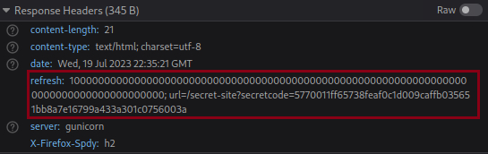
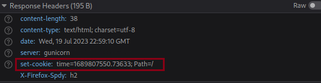
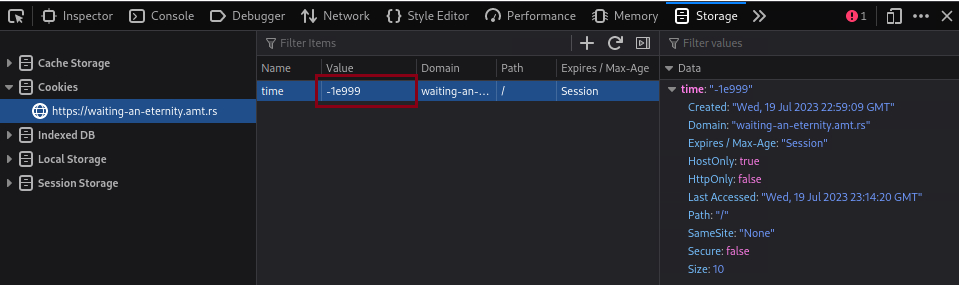

# waiting-an-eternity

## Description

> My friend sent me this website and said that if I wait long enough, I could get and flag! Not that I need a flag or anything, but I've been waiting a couple days and it's still asking me to wait. I'm getting a little impatient, could you help me get the flag?
>
> Author: voxal
>
> [`waiting-an-eternity.amt.rs`](https://waiting-an-eternity.amt.rs/)

Tags: _web_

## Solution

When we enter the website, we only see a text saying _just wait an eternity_. To solve this challenge, I first looked at the source code but found nothing interesting, then I took a look at the response headers using Firefox's inspector and found a refresh header, which after a very long time would redirect to `/secret-site?secretcode=5770011ff65738feaf0c1d009caffb035651bb8a7e16799a433a301c0756003a`.

We aren't going to wait such time, are we? let's go to that page directly. Once there, we can see another text: _welcome. please wait another eternity._ By looking again at the response headers, I noticed that the web page stored a time cookie using the following header: `set-cookie: time=1689807074.6310143; Path=/`.

If you refresh the page, it will say something like _you have not waited an eternity. you have only waited 174.5940363407135 seconds_, we should change our time cookie with an extremely large negative number to make it think that we have been waiting for an eternity, I used -1e999

Flag `amateursCTF{im_g0iNg_2_s13Ep_foR_a_looo0ooO0oOooooOng_t1M3}`
