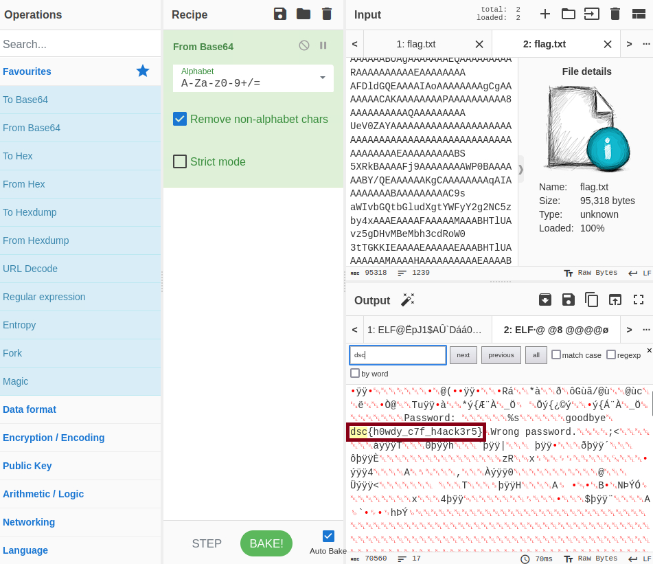

# Gibberish

## Description

> NASA receive a weird transmission yesterday but they were't able to decode it. I mean, it's just a bunch of gibberish. The only thing they have cracked was one word "goodbye"
> They have no clue what that means though. Can you help them?
>
> Author: DeconstruCT.F
>
> [`flag.txt`](./flag.txt)

Tags: _forensics_ \
Difficulty: _easy_ \
Points: _50_

## Solution

When using `cat` to see the contents of `flag.txt` we can see a lot of A characters and some `Base64` encoded text. You can feed [CyberChef](https://gchq.github.io/CyberChef/) with `flag.txt` and decode its contents using the block `From Base64` and `Ctrl + F` in the `Output` section to search for `dsc`, which is the prefix of the flag. Upon doing so, you will be able to view the complete flag in plain text.

Flag `dsc{h0wdy_c7f_h4ack3r5}`
