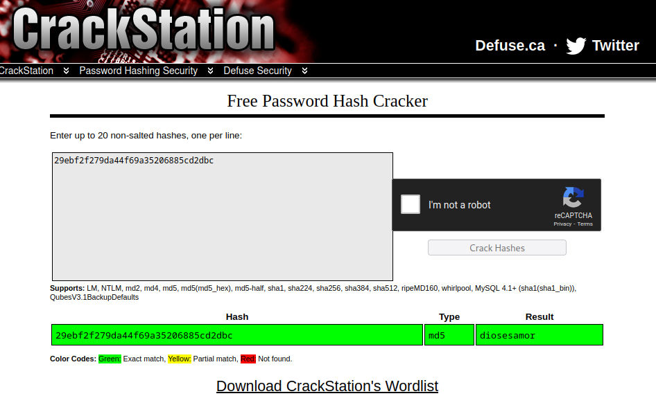

# Hash Roll

## Description

> Augustine's friend took a important file of augustine and stashed it.
> He was able to grab all the files from his friend's machine but he is worried that the files are encrypted. \
> Help him get the file back
>
> Hint: Rule 3 does not apply here. Bruteforce is allowed.
>
> Author: Rakhul
>
> [`encrypted1.zip`](./encrypted1.zip) [`nothing.pdf`](./nothing.pdf)

Tags: _forensics_ \
Difficulty: _easy_ \
Points: _50_

## Solution

We have two files, `encrypted1.zip` which needs a password to be opened, and `nothing.pdf` which has a snippet of [Never Gonna Give You Up](https://youtu.be/dQw4w9WgXcQ) lyrics

It is possible to extract more information from a pdf using the command `pdftohtml`

```
$ pdftohtml nothing.pdf
Page-1
```

In the `HTML` file generated by this tool, a new line is present after the lyrics.

```
...
29ebf2f279da44f69a35206885cd2dbc might be something you need
```

I tried to use that `MD5` hash as the `ZIP` file password but it did't work.

Next, I tried to crack the hash in [CrackStation](https://crackstation.net/) and was lucky



I used that password to open the `ZIP` file content and got the flag!


Flag `dsc{N3v3r_9OnNA_gIv3_y0u_up}`
