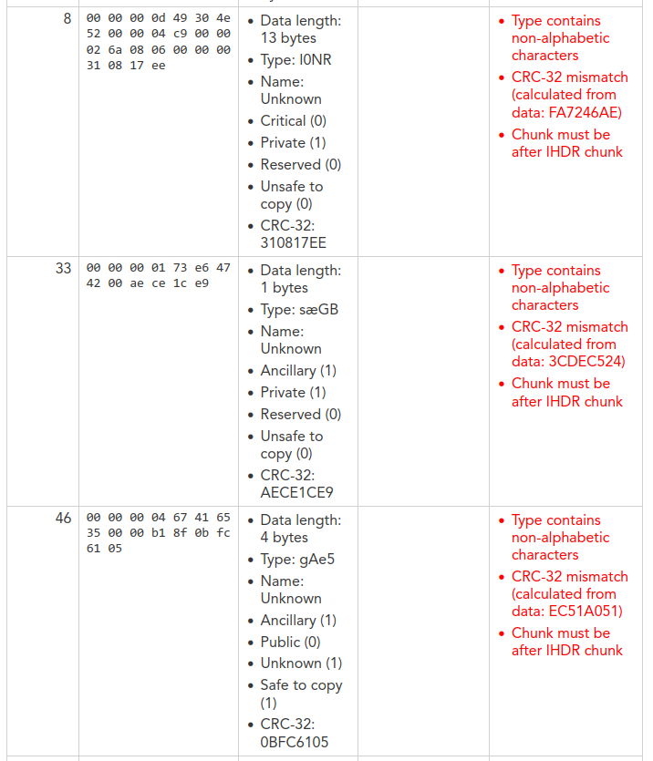
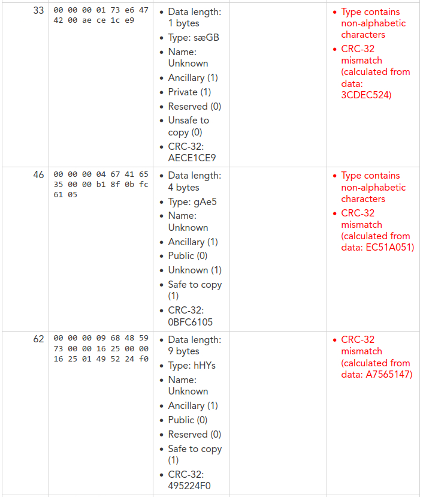

# Magicplay

## Description

> Dwayne's mischevious nephew played around in his pc and corrupted a very important file.. \
> Help dwayne recover it!
>
> Author: Rakhul
>
> [`magic_play`](./magic_play.png)

Tags: _forensics_ \
Difficulty: _medium_ \
Points: _50_

## Solution

The chal comes with a corrupted png file that is not even recognized as a `PNG`.

```
$ file magic_play.png
magic_play.png: data
```

but we know it is a `PNG` because it looks like a `PNG` when watching its hexadecimal values using the command `xxd`

```
$ xxd magic_play.png
00000000: 8957 c447 0d0a 1a0a 0000 000d 4930 4e52  .W.G........I0NR
00000010: 0000 04c9 0000 026a 0806 0000 0031 0817  .......j.....1..
00000020: ee00 0000 0173 e647 4200 aece 1ce9 0000  .....s.GB.......
00000030: 0004 6741 6535 0000 b18f 0bfc 6105 0000  ..gAe5......a...
00000040: 0009 6848 5973 0000 1625 0000 1625 0149  ..hHYs...%...%.I
00000050: 5224 f000 00ff a549 4441 5478 5eec dd07  R$.....IDATx^...
00000060: bc74 5755 36f0 9d50 44a5 f7de 557a 1369  .tWU6..PD...Uz.i
...
```

So to make it recognizable as a `PNG` file, we have to fix its `file signature` or `magic number` to the correct one, for this task I used the hex editor [`bless`](https://github.com/afrantzis/bless). We have `89 57 C4 47 0D 0A 1A 0A 00 00 00 0D` but should be `89 50 4E 47 0D 0A 1A 0A 00 00 00 0D`

Now, it should be recognized as a `PNG` file but it still cannot be opened, to address this issue I used this online [PNG analyzer](https://www.google.com/url?sa=t&rct=j&q=&esrc=s&source=web&cd=&cad=rja&uact=8&ved=2ahUKEwjB6Ye2pcmAAxU0I0QIHTXvCPkQFnoECBMQAQ&url=https%3A%2F%2Fwww.nayuki.io%2Fpage%2Fpng-file-chunk-inspector&usg=AOvVaw3vTMcCJlV2iwidkcNI9LlF&opi=89978449) which I like a lot because the information it shows is easy to understand.



There is a lot going on here, but let's approach the problem step by step

We know that every `PNG` file has the `IHDR` chunk following the `file signature`, so the `I0NR` chunk must correspond to the `IHDR` chunk. After, changing the type to the correct one we get this:



It seems that the chunk types after the `IHDR` chunk and before `IDAT` chunks are corrupted and need to be changed to their actual values. These could include: `PLTE` (Palette), `tRNS` (Transparency), `gAMA` (Gamma), `cHRM` (Primary Chromaticities), `sBIT` (Significant Bits), `bKGD` (Background Color), `pHYs` (Physical Pixel Dimensions), `tIME` (Image Last Modification Time) or `tEXt` (Textual Data).

Notably, `sæGB` resembles `bKGD`, `gAe5` resembles `gAMA`, and `hHYs` resembles `pHYs`. By changing them to the correct values, the PNG file gets fixed!


Flag `dsc{COrrupt3d_M4g1C_f1Ag}`
