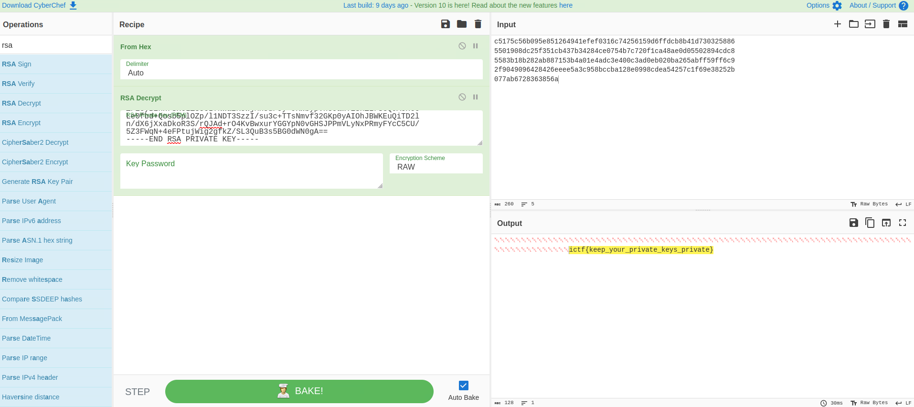

# RSA

## Description

> I think I did my RSA right...
>
> Author: Eth007
>
> https://imaginaryctf.org/r/Pg2iM#flag.enc \
> https://imaginaryctf.org/r/fpPlb#public.pem \
> https://imaginaryctf.org/r/uwcyX#private.pem

Tags: _crypto_

## Solution

Asymmetric encryption uses two keys, a public key for everyone to encrypt data, and a private key to the owner decrypt such data. So we only need `flag.enc` which has the flag ciphered and the private key to decrypt it. We can do this by following the next steps:

1. Retrieve the raw hexadecimal data from `flag.enc` to provide it as input to [`CyberChef`](https://gchq.github.io/CyberChef/) a useful tool for encryption, encoding, compression, and data analysis.

```
xxd -p flag.enc
```

2. Then, add the `From Hex` and `RSA Decrypt` blocks to the CyberChef Recipe. Copy and paste the private key from `private.pem` to the RSA Private Key (PEM) text input. Change the Encryption Scheme to RAW, and there you should have the flag!



Flag `ictf{keep_your_private_keys_private}`
