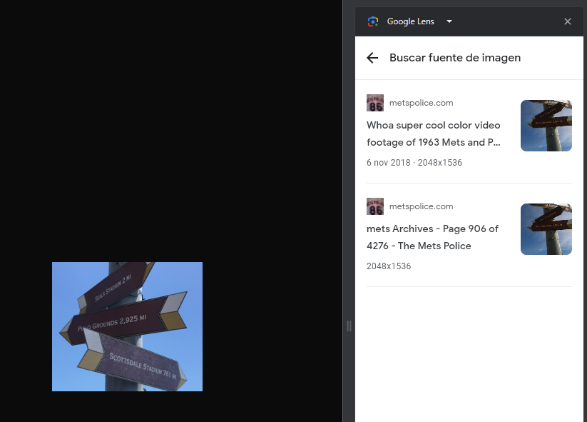
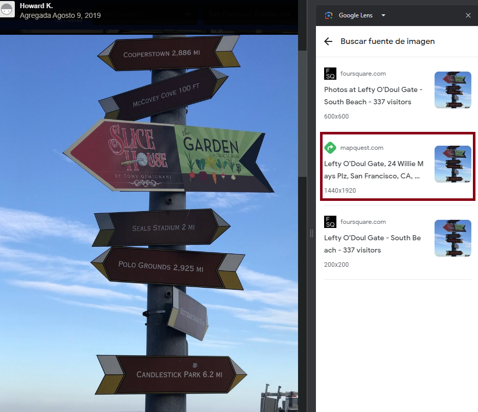
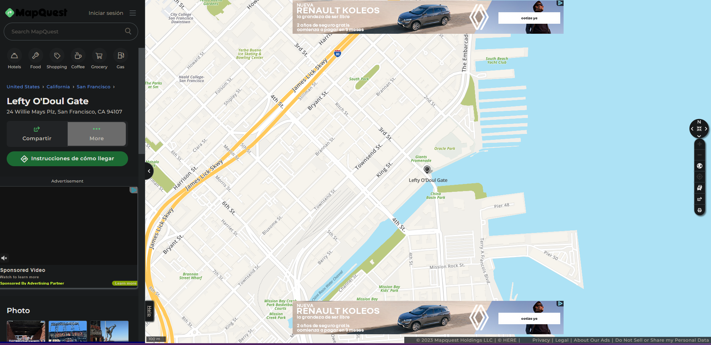
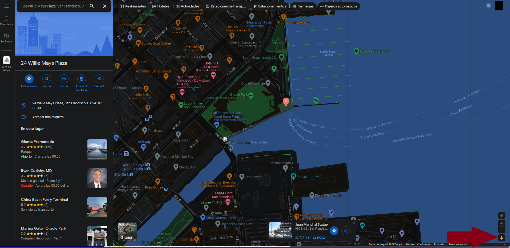
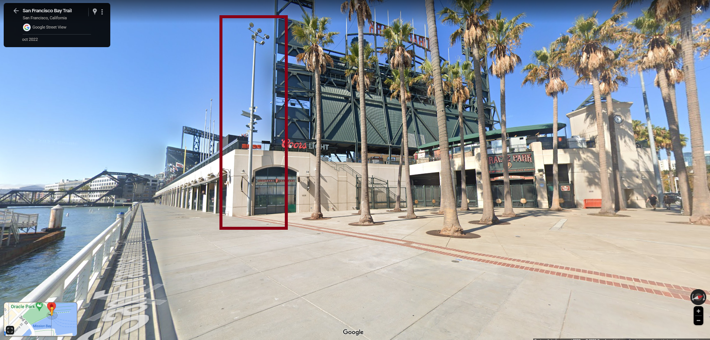

# signpost

## Description

> Tracking down pictures can be hard. Surely you can't find where this giant ballpark is...
>
> Submit your flag as ictf{latitude,longitude}, with the coordinates of where the picture was taken rounded to three decimal places. Example: ictf{-42.443,101.333}
>
> Author: Eth007
>
> https://imaginaryctf.org/r/sZAdu#signpost.png

Tags: _misc_

## Solution

A signpost image is attached to this challenge. My initial thought was to search for the places that were signaled in the post, but I thought it could be tedious. Instead, I examined the image metadata using exiftool, as images metadata sometimes contain the location where they were taken.

```
$ exiftool signpost.png
ExifTool Version Number         : 12.62
File Name                       : signpost.png
Directory                       : .
File Size                       : 103 kB
File Modification Date/Time     : 2023:07:21 21:24:26-06:00
File Access Date/Time           : 2023:07:21 21:24:30-06:00
File Inode Change Date/Time     : 2023:07:21 23:57:43-06:00
File Permissions                : -rw-r--r--
File Type                       : PNG
File Type Extension             : png
MIME Type                       : image/png
Image Width                     : 263
Image Height                    : 226
Bit Depth                       : 8
Color Type                      : RGB with Alpha
Compression                     : Deflate/Inflate
Filter                          : Adaptive
Interlace                       : Noninterlaced
SRGB Rendering                  : Perceptual
Gamma                           : 2.2
Pixels Per Unit X               : 5669
Pixels Per Unit Y               : 5669
Pixel Units                     : meters
Warning                         : [minor] Text/EXIF chunk(s) found after PNG IDAT (may be ignored by some readers)
Exif Byte Order                 : Big-endian (Motorola, MM)
Image Size                      : 263x226
Megapixels                      : 0.059

```

However, that wasn't the case. I then uploaded the image to `Google Lens` and asked it to find the source. This was the result:



I visited one of the resulting sites and repeated the process with the picture of the result site. I did this two times until I finally found this website



When entering, it shows the address, now we just need to find the exact location nearby



To do that, I used the little person on Google Maps to explore the area.



It was challenging to locate the post because it wasn't as visible as I initially thought, but in the end, I managed to find it.



I retrieved the precise location using Google Maps, and got the flag!

Flag `ictf{37.778,-122.388}`
