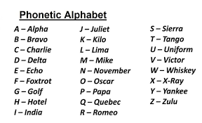

# BABY DUCKY NOTES

## Description

> We are sinking! The nearest ship got our SOS call, but they replied in pure gobbledygook! Are ye savvy enough to decode the message, or will we be sleepin' with the fish tonight? All hands on deck!
>
> Whiskey Hotel Four Tango Dash Alpha Romeo Three Dash Yankee Oscar Uniform Dash Sierra One November Kilo India November Golf Dash Four Bravo Zero Uniform Seven
>
> Author: hofill

Tags: _crypto|warmup_

## Solution

The provided text appears to be a `phonetic alphabet` representation of the flag. In the phonetic alphabet, each letter is represented by a specific word to ensure clear and accurate communication, especially in noisy or challenging environments. To decode the flag, you need to replace each word in the given text with the corresponding character or number it represents.

Flag `MAYDAY! - TFCCTF{WH4T-AR3-YOU-S1NKING-4B0U7}`
