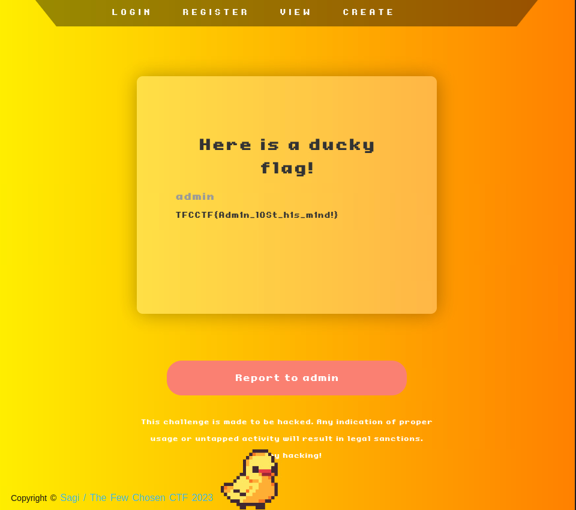

# BABY DUCKY NOTES

## Description

> Quack quack! Try and huack me!
>
> Author: Sagi
>
> [ducky_notes_1.zip](https://drive.google.com/file/d/1D8_UXgLD1loZ1her8NBL16T_1crCpKSc/view?usp=drive_link)

Tags: _web|warmup_

## Solution

The challenge comes with the source code and the docker file used to set the challenge container. By reading the source we can find an unexpected behavior in the `/posts/view/<user>` route handler:

```python
@web.route('/posts/view/<user>', methods=['GET'])
@auth_required
def posts_view(username, user):
    try:
        posts = db_get_user_posts(user, username == user)
    except:
        raise Exception(username)

    return render_template('posts.html', posts=posts)
```

See that?, the webpage does not validate that the parameter `<user>` actually matches the logged user, so any user can access any post of any user, just by knowing the username! So we can get the flag if we retrieve the admin posts by going to the following `URL`.

```
[your containter base url]/posts/view/admin
```



Flag `TFCCTF{Adm1n_l0St_h1s_m1nd!}`
