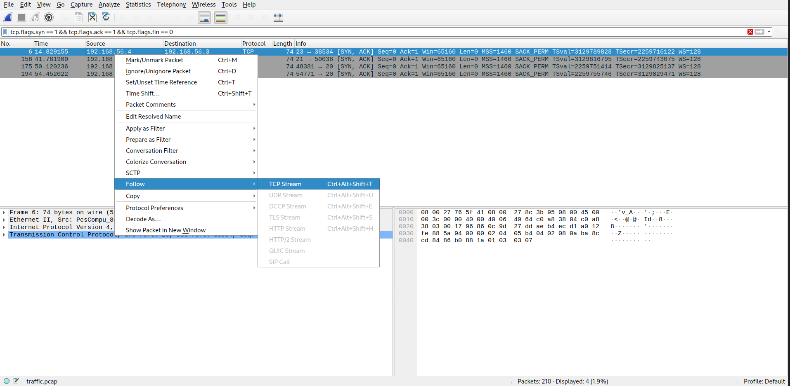

# Backup

## Description

> This company has an interesting approach to backuping their routers. I sniffed the network traffic while they conducted a backup. Check if you find something interesting.
>
> Author: rugo
>
> [`traffic.pcap`](traffic.pcap)

Tags: _cry, misc, bby_

## Solution

The challenge provides a .pcap file (a file that contains network traffic) that can be opened using the network protocol analyzer Wireshark.


There is a lot of information on the screen, but don't feel overwhelmed. We can filter the data and extract the relevant information by following these steps:

1. In the text input field at the top, enter the following filter:

```
tcp.flags.syn == 1 && tcp.flags.ack == 1 && tcp.flags.fin == 0
```

this filter will only capture the three-way handshake, which is the begining of every TCP connection.

2. Next, right-click on a packet and choose Follow -> TCP Stream. This will allow you to view the information transmitted in that particular connection.



By analyzing the data streams, we notice that it was a user that loged into a remote router via Telnet with the password `sup3rs3cur3`. After that, they activated the FTP protocol to retrieve a zip file called backup.zip to their local machine.


3. In stream 3, there is a `.zip` file (indicated by the file signature 'PK', which is specific to a .zip file). To extract it from wireshark, click on the upper left corner File->Export Objects->FTP Data, select the backup.zip packet and click Save.


Now we have a compressed .json file called secrets.json, and I am pretty sure that it contains the flag. However, it requires a password for decompression.


Luckily, the password is `sup3rs3cur3`, the one we found in stream 0!.


We were able to view the information in plain text because it was not encrypted, highlighting the importance of using SSH instead of Telnet and SFTP instead of FTP. Encryption ensures the security and confidentiality of data during transmission.

Flag `flag{TelnetAndFTPAreSoVErySecure}`
